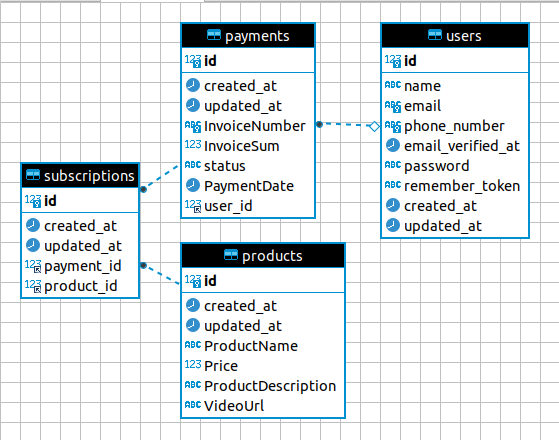

## About Project

This Web application is built using following stack

- [Laravel Framework 9.0](https://laravel.com/).
- [Laravel Breeze](https://laravel.com/docs/9.x/starter-kits#laravel-breeze).
- [Blade Engine](https://laravel.com/docs/9.x/blade#main-content),
- [MySQL](https://mysql.com).
- [PHP 8.1](https://www.php.net/releases/8.1/en.php).


## Running Project

Run Following Command, to run this project :

- Run Database Migrations
```shell    
php artisan migrate
```
- Run Database Seeder
```shell
php artisan db:seeder
```

## Database Architecture

Based on the user story attached, below is the data architecture for achive the userstory goal.

.

payments and products is linked with many to many relationship


